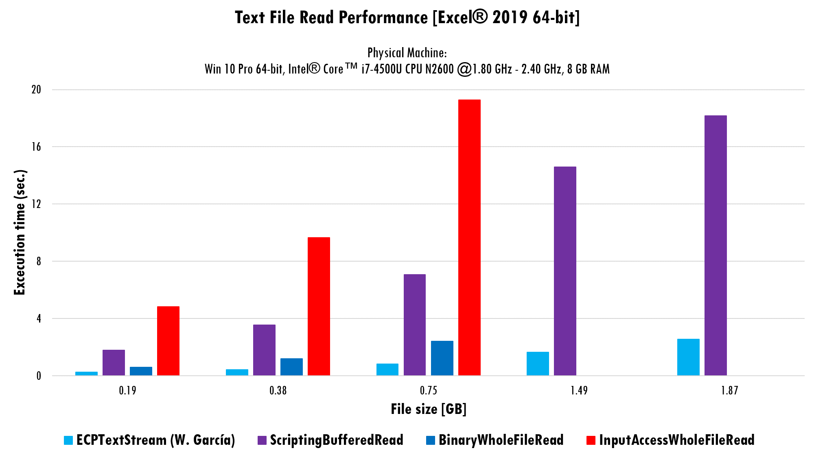

# Getting Started
{: .fs-9 }

---

{: .no_toc }

<details open markdown="block">
  <summary>
    Table of contents
  </summary>
  {: .text-delta }
1. TOC
{:toc}
</details>

In order to be able to use `ECPTextStream.cls` module within your project, please review the installation instructions by clicking the button below.

[Installation](https://ws-garcia.github.io/ECPTextStream/home/installation.html){: .btn .btn-green }

VBA has several native functions and statements to enable I/O operations over text files. In adition, the language can use other API's like the `FileSystemObject` (FSO) provided by the Microsoft Scripting Runtime library. In [this](https://stackoverflow.com/questions/1376756/what-is-a-superfast-way-to-read-large-files-line-by-line-in-vba/27674729#27674729) Stack Overflow post, andrewsi concludes that read the whole file content using VBA's native `Binary` access is faster than read the file line by line with the `Input Line` statement and also faster than read using the FSO's API.

After run some tests, comes to reality a "weakness" related to the memory overload and the VBA's data communication with external APIs. Excel application crashed when trying to load the content from some files and, dealing with the same files, VBA throw an exception. ECPTextStream is intended to overcome this difficulties and enhance the overall performance of the I/O operations over text files.

## Philosophy

The VBA ECPTextStream class module is designed for turn the VBA's embedded file statements into a powerful, extensible and easy to use set of code, that let the user controls how a file is sliced and streamed.

## Usage

Stream a CSV file

```vb
Sub StreamCSV()
    Dim Path As String
    Dim TextStream As ECPTextStream
    
    Path = "C:\16000000.quoted.csv"
    Set TextStream = New ECPTextStream
    TextStream.OpenStream Path
    TextStream.EndStreamOnLineBreak = True
    Do While Not TextStream.AtEndOfStream
        TextStream.ReadText
    Loop
    TextStream.CloseStream
    Set TextStream = Nothing
End Sub
```

Stream file and save its content to an array

```vb
Sub StreamAndSave()
    Dim tmpArray() As String
    Dim Path As String
    Dim i As Single
    Dim TextStream As ECPTextStream
    
    Path = "C:\6400000.quoted.csv"
    Set TextStream = New ECPTextStream
    TextStream.OpenStream Path
    TextStream.EndStreamOnLineBreak = True
    ReDim tmpArray(0 To Fix(TextStream.StreamLength / TextStream.BufferLen) + 1)
    Do While Not TextStream.AtEndOfStream
        TextStream.ReadText
        tmpArray(i) = TextStream.BufferString
        i = i + 1
    Loop
    TextStream.CloseStream
End Sub
```

>⚠️**Caution**
>{: .text-grey-lt-000 .bg-green-000 }
>Isn't recommended to store the streamed data, especially if the opened file has more than 1 GB of size.
{: .text-grey-dk-300 .bg-yellow-000 }

## Benchmark

The ECPTextStream class was tested with files from 191 MB to 1.87 GB of size, you can download the test files from [here](https://github.com/ws-garcia/ECPTextStream/raw/main/test-assets/BigTextFiles.zip). Below is showed the procedures for stablish the benchmark for the read operations. Some procedures are available on internet.

```vb
Sub BufferedRead(FilePath As String)
    Dim TextStream As ECPTextStream
    
    Set TextStream = New ECPTextStream
    TextStream.OpenStream FilePath
    Do While Not TextStream.AtEndOfStream
        TextStream.ReadText
    Loop
    TextStream.CloseStream
    Set TextStream = Nothing
End Sub
```

```vb
Sub BinayWholeFileRead(FilePath As String, ByRef OutputStr As String)
    Dim EOFile As Long
    Dim FileHandled As Integer
    
    FileHandled = FreeFile
    Open FilePath For Binary As #FileHandled
    EOFile = LOF(FileHandled)
    OutputStr = Space$(EOFile)
    Get #FileHandled, , OutputStr
    Close #FileHandled
End Sub
```

```vb
Sub InputAccessWholeFileRead(FilePath As String, ByRef OutputStr As String)
    Dim EOFile As Long
    Dim FileHandled As Integer
    
    FileHandled = FreeFile
    Open FilePath For Input As #FileHandled
    EOFile = LOF(FileHandled)
    OutputStr = Input(EOFile, FileHandled)
    Close #FileHandled
End Sub
```

```vb
Sub ScriptingWholeFileRead(FilePath As String, ByRef OutputStr As String)
    '@--------------------------------------------------------------------------
    ' VB & VBA in a Nutshell: The language, eMaster Edition, O'Reilly, 2000, Paul Lomax
	 
    Dim EOFile As Long
    Dim ofsFileSys As New Scripting.FileSystemObject
    Dim ofsTextStream As TextStream
    
    Set ofsTextStream = ofsFileSys.OpenTextFile(FilePath)
    OutputStr = ofsTextStream.ReadAll
    Set ofsTextStream = Nothing
End Sub
```

```vb
Sub ScriptingBufferedRead(FilePath As String, ByRef OutputStr As String)
    Dim ofsFileSys As New Scripting.FileSystemObject
    Dim ofsTextStream As TextStream
    Dim BufferLen As Long
    Dim EOFile As Boolean
    
    BufferLen = CLng(0.5 * 1048576 / 2)
    Set ofsTextStream = ofsFileSys.OpenTextFile(FilePath)
    With ofsTextStream
        Do Until EOFile
            OutputStr = ofsTextStream.Read(BufferLen)
            EOFile = .AtEndOfStream
        Loop
    End With
    Set ofsTextStream = Nothing
End Sub
```

The image below shows the overall performance for the read operations.



>📝**Note**
>{: .text-grey-lt-000 .bg-green-000 }
>The procedures for read the whole file content at once, fails dealing with the 1.49 and 1.87 GB files. The `ScriptingWholeFileRead` procedure crash Excel and cause its restart, the rest of this kind of procedures cause a VBA exception when working over the cited files.
{: .text-grey-dk-300 .bg-grey-lt-000 }

### Conclusions

- `ECPTextStream` buffered read is 6x times faster than the `FileSystemObject` (FSO) counterpart, with both working from VBA.
- Open text file for Binary access is faster than other methods.
- The VBA performance is, apparently, linked to memory load. This can explain the performance drop of procedures for read the whole text file's content at once.
- Read file using buffer is faster than read the whole file.

## Licence

Copyright (C) 2021-2022  [W. García](https://github.com/ws-garcia/).

This program is free software: you can redistribute it and/or modify it under the terms of the GNU General Public License as published by the Free Software Foundation, either version 3 of the License, or (at your option) any later version.

This program is distributed in the hope that it will be useful, but WITHOUT ANY WARRANTY; without even the implied warranty of MERCHANTABILITY or FITNESS FOR A PARTICULAR PURPOSE.  See the GNU General Public License for more details.

You should have received a copy of the GNU General Public License along with this program.  If not, see <https://www.gnu.org/licenses/gpl-3.0.html>.
