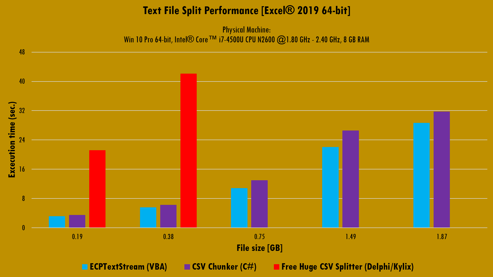

# Simple CSV and Text files Splitter
{: .fs-9 }

The ECPTextStream class module can be used for a variety of porposes. In this section I will share with you a simple Workbook project that can split CSV and Text files by lines. 

The cited functionality has been well discussed over the internet but, however, there are ways to improve any solution given on. Although VBA is known as a low speed language, the programmer can use some tools to explote all its potential and this is, precisely the objetive of the ECPTextStream class module.

The tool covered here, which can be downloaded [from this link](https://github.com/ws-garcia/ECPTextStream/raw/main/test-assets/Split_Text_Files.xlsm), was tested agains two softwares. In each test the original file is splitted into four (4) pieces and the first line, of the source file, is repeated in each one when this option is available. The solutions to test over are:

- [CSV Chunker](http://www.scaled-solutions.com/sites/default/files/CSV%20Chunker.zip), written in C#.
- [Free Huge CSV Splitter](https://sourceforge.net/projects/splitcsv/), written in Delphi/Kylix.

The image below shows the benchmark for the test.

As we can see, the performance limitations of VBA can be mitigated when proper techniques are used to perform a certain task. By its way, the [Free Huge CSV Splitter](https://sourceforge.net/projects/splitcsv/) spences more than 90 seconds to split the 0.75 GB file.